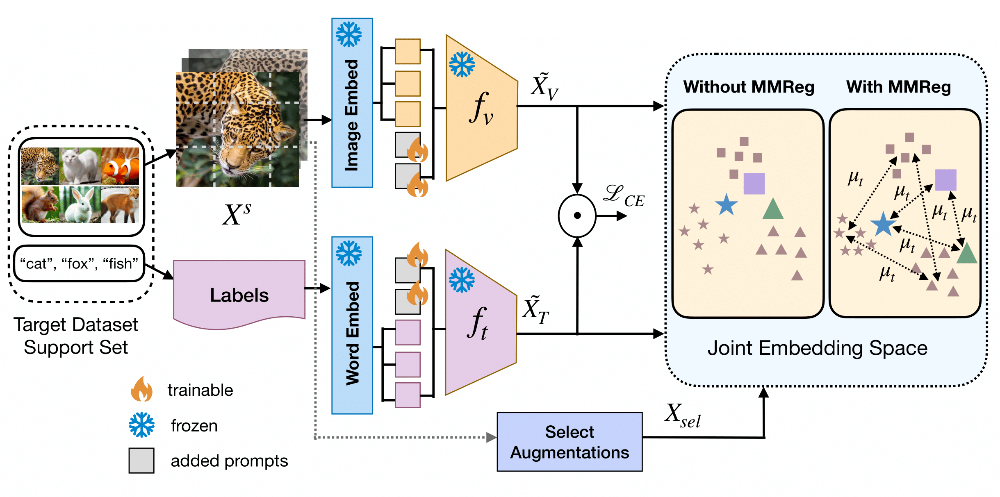

## PromptMargin
[Prompt Tuning Vision Language Models with Margin Regularizer for Few-Shot Learning under Distribution Shift](https://openreview.net/pdf?id=ZnWqtPhHM7)



## Install
Clone this git repository and create the environment:
```
git clone https://github.com/debarshigit/PromptMargin.git
cd PromptMargin
conda env create --promptmargin.yml
conda activate promptmargin

# Alternatively you can install missing packages:
pip install requirements.txt
```

## Datasets
Download datasets from: [cdfsl-benchmark](https://github.com/IBM/cdfsl-benchmark?tab=readme-ov-file).
The folder structure should be:
```
datasets_for_bscdfsl
|--Chest_Xray
  |--images
  |--Data_Entry_2017.csv
|--DATA
  |--eurosat
    |--2750
|--ISIC2018_Task3_Training_Input
|--Plant_disease
  |--dataset
    |--test
      |--Apple__Apple_scab
      |--Apple_Black_rot
      ...
    |--train
      |--Apple__Apple_scab
      |--Apple_Black_rot
      ...
|--ISIC2018_Task3_Test_GroundTruth.csv
|--ISIC2018_Task3_Training_GroundTruth.csv
|--ISIC2018_Task3_Validation_GroundTruth.csv
```
## How to run
You can run individual .py files for each dataset from the train_files folder:
```
# example: to run for the EuroSAT dataset
python train_test_cdfsl_eurosat.py
```
Alternatively, you can run directly from the bash script file by just giving the dataset name:
```
# <dataset_name> can be eurosat, isic, plant_disease, chestxray
bash train_test.sh <dataset_name>
```
## Acknowledgements
[cdfsl-benchmark](https://github.com/IBM/cdfsl-benchmark?tab=readme-ov-file)

[MaPLe](https://github.com/muzairkhattak/multimodal-prompt-learning)

[StyleAdv-CDFSL](https://github.com/lovelyqian/StyleAdv-CDFSL)

[Channel_Importance_FSL](https://github.com/Frankluox/Channel_Importance_FSL)

